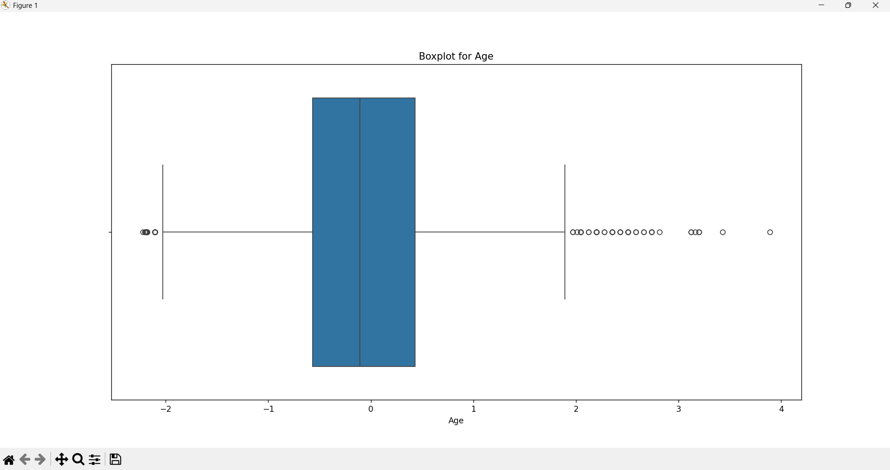

# Task01
# Task 1: Data Cleaning & Preprocessing

## Objective
Clean and prepare raw Titanic dataset for machine learning.

## Tools Used
- Python
- Pandas
- NumPy
- Matplotlib / Seaborn
- Scikit-learn

## Steps Performed
1. Imported and explored the dataset.
2. Handled missing values using median/mode.
3. Encoded categorical features (`Sex`, `Embarked`) using LabelEncoder.
4. Normalized `Age` and `Fare` using StandardScaler.
5. Visualized and removed outliers using boxplots and IQR method.
6. Saved the cleaned dataset.

## How to Run
1. 
   ```bash
   python task01.py
   ```

   
## Screenshot


## Dataset
You can download the Titanic dataset from [Kaggle](https://www.kaggle.com/c/titanic/data) or use the one provided here.

